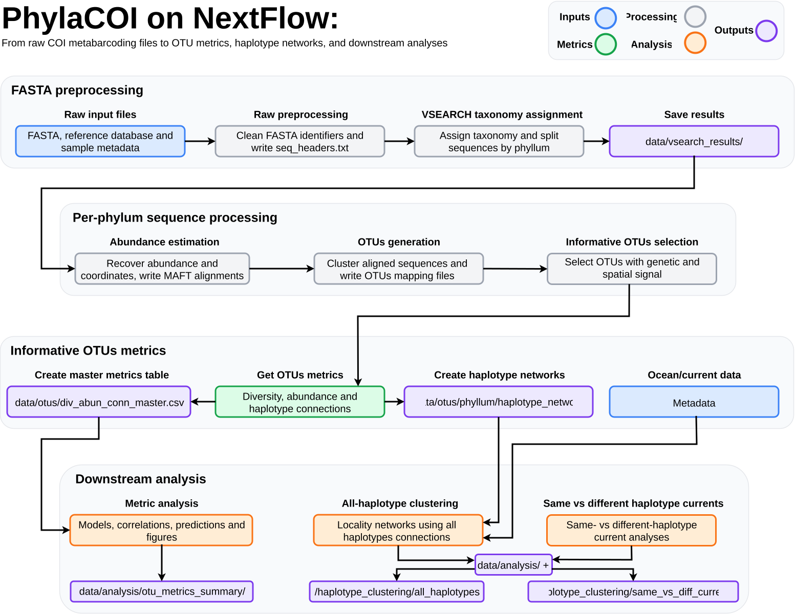

# Nextflow Workflow

This folder contains a Nextflow workflow for running the complete `phylaCOI` pipeline.

The workflow uses the same input files, scripts, and output structure described in the main repository [documentation](../../README.md). It is designed for local execution on standard computers. After taxonomic assignment, the data are organized into one folder per phylum, and the downstream scripts process those phylum folders to get the final results.

## Files

| File | Description |
|------|-------------|
| `main.nf` | Main Nextflow workflow. It defines the ordered processes and the files passed between them. |
| `src/` | Small workflow helper scripts. |
| `nextflow.config` | Default parameters and execution settings. |
| `params.yaml` | Example parameter file that can be copied or edited for custom runs. |
| `environment.yml` | Micromamba/conda environment with Nextflow and the dependencies required by the pipeline. |

## Software Environment

The recommended environment is named `phylaCOI`. It contains:

- Nextflow and Java.
- Python packages used by the preprocessing, abundance, and OTU-generation scripts.
- R and the R/Bioconductor packages used by the OTU metrics, metrics analysis, and haplotype clustering scripts.
- External command-line tools: VSEARCH and MAFFT.

Install the environment from the repository root:

```bash
micromamba env create -f nextflow/environment.yml
```

Alternatively, create the same environment with conda:

```bash
conda env create -f nextflow/environment.yml
```

Activate it before running the workflow:

```bash
micromamba activate phylaCOI
```

With conda, use:

```bash
conda activate phylaCOI
```

Check that the main tools are available:

```bash
nextflow -version
vsearch --version
mafft --version
Rscript --version
python --version
```

## Required Input Files

By default, the workflow expects the initial files in `data/raw/`:

| Parameter | Default path | Description |
|-----------|--------------|-------------|
| `raw_fasta` | `data/raw/eKOI_metabarcoding.fasta` | Raw metabarcoding FASTA file. |
| `reference_db` | `data/raw/eKOI_database.fasta` | Reference FASTA database used by VSEARCH for taxonomic assignment. |
| `sample_metadata` | `data/raw/KOI_metadata.csv` | Sample metadata used to recover sequence abundance, locality, and coordinate information. |
| `ocean_metadata` | `data/raw/ocean_metadata.csv` | Locality-level ocean/current metadata used by the haplotype clustering step. |
| `output_root` | `data` | Root folder where workflow outputs are published. |

The workflow also exposes these analysis parameters:

| Parameter | Default | Description |
|-----------|---------|-------------|
| `vsearch_identity` | `0.84` | Minimum identity used for VSEARCH taxonomic assignment. |
| `otu_identity` | `0.97` | Sequence identity threshold used for OTU clustering. |
| `run_mafft` | `1` | Whether to run MAFFT during abundance estimation (`1`) or skip alignment (`0`). |
| `min_otus` | `10` | Minimum number of OTUs required for a phylum to be included in the metrics analysis. |
| `write_maps` | `true` | Whether to generate map outputs in the OTU metrics and all-haplotype clustering steps. |

## Workflow Structure



## Phylum-Level Organization

The pipeline is organized around phylum folders after the taxonomic assignment step. `VSEARCH_TAXONOMY` creates the initial phylum-specific FASTA folders, and the following steps read and write matching phylum folders in `data/abundance/` and `data/otus/`.

This organization keeps intermediate files separated by taxonomic group and is a practical solution: each stage writes results to disk before the next stage starts, so failed steps can be inspected and repeated without manually rebuilding the entire analysis.

## Workflow Components

### `Raw preprocessing`

Calls:

```bash
python scripts/1_raw_data_processing/fasta_preprocess.py
```

Purpose:

- Reads the raw metabarcoding FASTA file.
- Writes the original sequence headers to `seq_headers.txt`.
- Writes a cleaned FASTA file with simplified identifiers.

Outputs:

| Output | Location |
|--------|----------|
| `seq_headers.txt` | `data/raw/seq_headers.txt` |
| `eKOI_metabarcoding_cleaned.fasta` | `data/procesed/eKOI_metabarcoding_cleaned.fasta` |

For more information, see [Raw preprocessing](../../scripts/1_raw_data_processing/readme.md).

### `VSEARCH taxonomy assignment`

Calls:

```bash
python scripts/1_raw_data_processing/vsearch_taxonomy.py
```

Purpose:

- Runs VSEARCH against the reference database.
- Filters taxonomic hits using `vsearch_identity`.
- Splits the cleaned sequences into one folder per phylum.
- Flattens the VSEARCH output so downstream steps read `data/vsearch_results/<phylum>/`.

Output:

| Output | Location |
|--------|----------|
| VSEARCH results and phylum FASTA folders | `data/vsearch_results/` |

For more information, see [VSEARCH taxonomy assignment](../../scripts/1_raw_data_processing/readme.md).

### `Abundance estimation`

Calls:

```bash
python scripts/2_abundance_estimation/get_abundance.py
```

Purpose:

- Reads the phylum folders generated by taxonomic assignment.
- Uses `seq_headers.txt` and `KOI_metadata.csv` to recover abundance, locality, and coordinates.
- Writes one abundance table per phylum.
- Writes one unique-sequence FASTA per phylum.
- Runs MAFFT when `run_mafft = 1`.

Output:

| Output | Location |
|--------|----------|
| Per-phylum abundance and alignment files | `data/abundance/` |

Expected structure:

```text
data/abundance/
├── Phylum1/
│   ├── abundances.csv
│   ├── unique_sequences.fasta
│   └── aligned_sequences_mafft.fasta
└── Phylum2/
    ├── abundances.csv
    ├── unique_sequences.fasta
    └── aligned_sequences_mafft.fasta
```

For more information, see [Abundance estimation](../../scripts/2_abundance_estimation/readme.md).

### `OTUs generation`

Calls:

```bash
python scripts/3_otu_generation/generate_otus.py
```

Purpose:

- Reads the MAFFT-aligned sequences from `data/abundance/`.
- Cleans aligned FASTA files for clustering.
- Runs VSEARCH clustering using `otu_identity`.
- Writes OTU FASTA, `.uc`, and mapping files per phylum.

Output:

| Output | Location |
|--------|----------|
| Per-phylum OTU files | `data/otus/` |

Expected structure:

```text
data/otus/
├── Phylum1/
│   ├── aligned_sequences_cleaned.fasta
│   ├── otus.fasta
│   ├── otus.uc
│   └── otus_mapping.txt
└── Phylum2/
    ├── aligned_sequences_cleaned.fasta
    ├── otus.fasta
    ├── otus.uc
    └── otus_mapping.txt
```

For more information, see [OTUs generation](../../scripts/3_otu_generation/README.md).

### `Informative OTUs selection`

Calls:

```bash
Rscript scripts/3_otu_generation/get_informative_otus.R
```

Purpose:

- Reads the abundance and OTU mapping files for each phylum.
- Computes genetic and geographic distance information.
- Keeps OTUs with enough sequence and spatial variation for downstream analyses.
- Writes the informative OTU list inside each phylum folder.

Output:

| Output | Location |
|--------|----------|
| `informative_OTUs.txt` per phylum | `data/otus/<phylum>/informative_OTUs.txt` |

For more information, see [Informative OTUs selection](../../scripts/3_otu_generation/README.md).

### `Get OTUs metrics`

Calls:

```bash
Rscript scripts/4_otu_metrics/get_div_abun_conn.R
```

Purpose:

- Uses only the informative OTUs.
- Computes OTU-level nucleotide diversity, abundance, and haplotype-connection metrics.
- Writes per-phylum metric tables.
- Writes haplotype-network input tables used by the clustering workflow.
- Builds a global metrics table across all processed phyla.

Outputs:

| Output | Location |
|--------|----------|
| Per-phylum OTU metrics | `data/otus/<phylum>/informative_otus_metrics/` |
| Haplotype-network edge and point tables | `data/otus/<phylum>/haplotype_network/` |
| Global metrics table | `data/otus/div_abun_conn_master.csv` |

For more information, see [Get OTUs metrics](../../scripts/4_otu_metrics/README.md).

### `Metrics analysis`

Calls:

```bash
Rscript scripts/5_metrics_analysis/analyze_otu_metrics.R
```

Purpose:

- Reads `data/otus/div_abun_conn_master.csv`.
- Keeps only phyla with at least `min_otus` OTUs.
- Fits distance-decay models for abundance, diversity, and connections.
- Computes correlations, model summaries, predictions, and figures.

Output:

| Output | Location |
|--------|----------|
| Metrics analysis tables and figures | `data/analysis/otu_metrics_summary/` |

For more information, see [Metrics analysis](../../scripts/5_metrics_analysis/README.md).

### `All-haplotype clustering`

Calls:

```bash
Rscript scripts/6_haplotype_clustering/run_all_haplotypes_clustering.R
```

Purpose:

- Reads haplotype-network files written by `OTU_METRICS`.
- Builds locality-level networks using all haplotype connections.
- Runs locality clustering.
- Joins the clustering results with ocean/current metadata.
- Writes clustering tables, summaries, and maps.

Output:

| Output | Location |
|--------|----------|
| All-haplotype clustering outputs | `data/analysis/haplotype_clustering/all_haplotypes/` |

For more information, see [All-haplotype clustering](../../scripts/6_haplotype_clustering/README.md).

### `Same vs different haplotypes current`

Calls:

```bash
Rscript scripts/6_haplotype_clustering/run_same_vs_diff_currents.R
```

Purpose:

- Reuses the haplotype-network files from `OTU_METRICS`.
- Uses the all-haplotype output as a reference.
- Compares networks built from same-haplotype and different-haplotype connections.
- Summarizes how inferred clusters relate to ocean/current categories.

Output:

| Output | Location |
|--------|----------|
| Same-vs-different haplotype current analysis | `data/analysis/haplotype_clustering/same_vs_diff_currents/` |

For more information, see [Same vs different haplotypes current](../../scripts/6_haplotype_clustering/README.md).

## Basic Run

Run from the repository root after activating the `phylaCOI` environment:

```bash
nextflow run nextflow/main.nf \
  -c nextflow/nextflow.config
```

To resume after an interrupted run:

```bash
nextflow run nextflow/main.nf \
  -c nextflow/nextflow.config \
  -resume
```

Nextflow stores execution metadata in the hidden `.nextflow/` folder and process working directories in `work/`. These folders are useful for resuming runs and inspecting failed tasks.

## Custom Parameters

Parameters can be changed directly in the command:

```bash
nextflow run nextflow/main.nf \
  -c nextflow/nextflow.config \
  --raw_fasta data/raw/my_metabarcoding.fasta \
  --reference_db data/raw/my_reference_db.fasta \
  --sample_metadata data/raw/my_sample_metadata.csv \
  --ocean_metadata data/raw/my_ocean_metadata.csv \
  --output_root data
```

They can also be changed in a parameter file:

```bash
nextflow run nextflow/main.nf \
  -c nextflow/nextflow.config \
  -params-file nextflow/params.yaml
```

Example `params.yaml`:

```yaml
raw_fasta: data/raw/eKOI_metabarcoding.fasta
reference_db: data/raw/eKOI_database.fasta
sample_metadata: data/raw/KOI_metadata.csv
ocean_metadata: data/raw/ocean_metadata.csv
output_root: data

vsearch_identity: 0.84
otu_identity: 0.97
run_mafft: 1
min_otus: 10
```

## Output Summary

```text
data/
├── raw/
│   └── seq_headers.txt
├── procesed/
│   └── eKOI_metabarcoding_cleaned.fasta
├── vsearch_results/
│   └── <phylum folders and VSEARCH reports>
├── abundance/
│   └── <phylum folders with abundances and alignments>
├── otus/
│   ├── <phylum folders with OTUs, informative OTUs, metrics, and haplotype networks>
│   └── div_abun_conn_master.csv
└── analysis/
    ├── otu_metrics_summary/
    └── haplotype_clustering/
        ├── all_haplotypes/
        └── same_vs_diff_currents/
```

## Troubleshooting

Inspect a failed process:

```bash
nextflow log
```

Then open the corresponding `.command.log`, `.command.err`, and `.command.sh` files inside the relevant `work/` subfolder.
