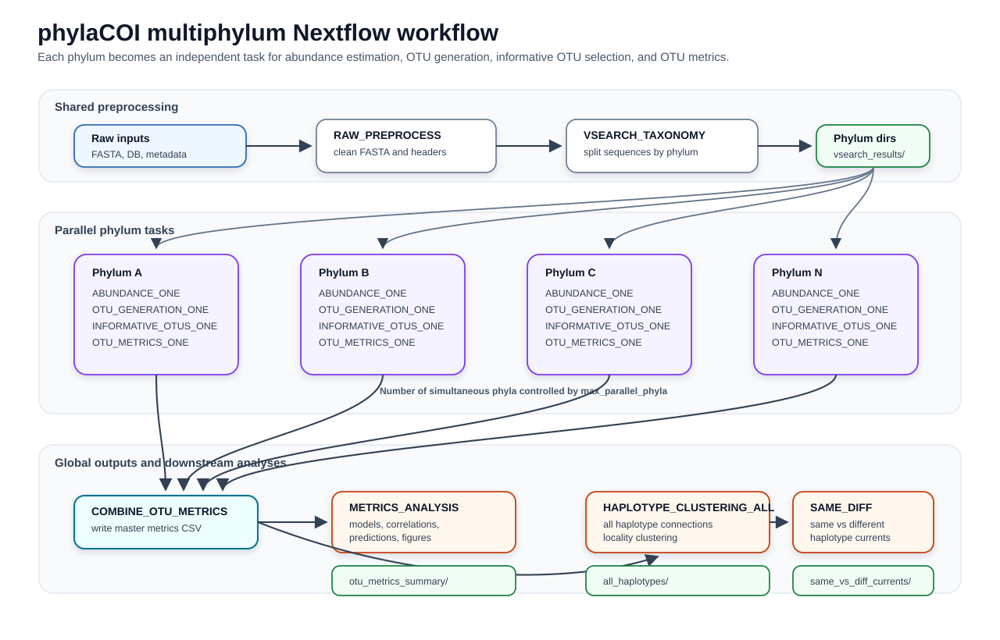

# Multiphylum Nextflow Workflow

This folder contains a Nextflow workflow that runs the `phylaCOI` pipeline with phylum-level parallelization.

After the VSEARCH taxonomic assignment step, each detected phylum folder is treated as an independent unit of work. Nextflow can then run abundance estimation, OTU generation, informative OTU selection, and OTU metrics for several phyla at the same time. The number of simultaneous phylum tasks is controlled by `max_parallel_phyla`, which makes this workflow suitable for local computers and small compute servers.

All files needed by this implementation are kept inside `workflows/nextflow_multiphylum/`, except for the core pipeline scripts and shared functions that already exist in `scripts/` and `src/`.

## Files

| File or folder | Description |
|----------------|-------------|
| `main.nf` | Main Nextflow workflow with phylum-level channels and processes. |
| `nextflow.config` | Default parameters and local execution settings. |
| `params.yaml` | Example parameter file for custom runs. |
| `environment.yml` | Micromamba/conda environment required to run the workflow. |
| `src/` | Helper wrappers used only by this multiphylum workflow. |
| `assets/workflow_multiphylum.svg` | Workflow diagram used in this README. |

## Workflow Diagram



## Software Environment

Create the recommended environment from the repository root:

```bash
micromamba env create -f workflows/nextflow_multiphylum/environment.yml
```

Activate it before running the workflow:

```bash
micromamba activate phylaCOI
```

If the environment already exists:

```bash
micromamba env update -n phylaCOI -f workflows/nextflow_multiphylum/environment.yml
```

Check the main tools:

```bash
nextflow -version
python --version
Rscript --version
vsearch --version
mafft --version
```

## Required Inputs

By default, the workflow expects:

| Parameter | Default path | Description |
|-----------|--------------|-------------|
| `raw_fasta` | `data/raw/eKOI_metabarcoding.fasta` | Raw metabarcoding FASTA file. |
| `reference_db` | `data/raw/eKOI_database.fasta` | Reference FASTA database used by VSEARCH. |
| `sample_metadata` | `data/raw/KOI_metadata.csv` | Sample metadata with locality, coordinate, and abundance information. |
| `ocean_metadata` | `data/raw/ocean_metadata.csv` | Ocean/current metadata used by the haplotype clustering analyses. |
| `output_root` | `data` | Root folder where outputs are published. |

## Main Parameters

| Parameter | Default | Description |
|-----------|---------|-------------|
| `vsearch_identity` | `0.84` | Minimum identity for VSEARCH taxonomic assignment. |
| `otu_identity` | `0.97` | Sequence identity threshold for OTU clustering. |
| `run_mafft` | `1` | Run MAFFT during abundance estimation (`1`) or skip it (`0`). |
| `min_otus` | `10` | Minimum number of OTUs required for a phylum to be included in metrics analysis. |
| `max_parallel_phyla` | `2` | Maximum number of phyla processed at the same time. Increase only if the machine has enough CPU and memory. |
| `max_otu_seqs` | `500` | Maximum number of sequences per OTU used when building haplotype networks. |
| `cluster_radius_km` | `5` | Geographic radius used to group nearby points into local clusters. |
| `write_maps` | `true` | Write map outputs during OTU metrics and all-haplotype clustering. |

## Basic Run

Run from the repository root:

```bash
nextflow run workflows/nextflow_multiphylum/main.nf \
  -c workflows/nextflow_multiphylum/nextflow.config
```

Resume an interrupted run:

```bash
nextflow run workflows/nextflow_multiphylum/main.nf \
  -c workflows/nextflow_multiphylum/nextflow.config \
  -resume
```

Run with a different number of simultaneous phyla:

```bash
nextflow run workflows/nextflow_multiphylum/main.nf \
  -c workflows/nextflow_multiphylum/nextflow.config \
  --max_parallel_phyla 4
```

Use a parameter file:

```bash
nextflow run workflows/nextflow_multiphylum/main.nf \
  -c workflows/nextflow_multiphylum/nextflow.config \
  -params-file workflows/nextflow_multiphylum/params.yaml
```

## Workflow Components

### Shared Preprocessing

`RAW_PREPROCESS` calls:

```bash
python scripts/1_raw_data_processing/fasta_preprocess.py
```

It writes `seq_headers.txt` and the cleaned metabarcoding FASTA file.

`VSEARCH_TAXONOMY` calls:

```bash
python scripts/1_raw_data_processing/vsearch_taxonomy.py
```

It assigns taxonomy with VSEARCH and creates phylum-specific FASTA folders. The helper `src/flatten_vsearch_results.py` then flattens those outputs so Nextflow can detect one folder per phylum.

### Per-Phylum Processes

The following processes run once per phylum folder:

| Process | Helper wrapper | Purpose |
|---------|----------------|---------|
| `ABUNDANCE_ONE` | `src/run_abundance_one_phylum.py` | Generates `abundances.csv`, `unique_sequences.fasta`, and `aligned_sequences_mafft.fasta` for one phylum. |
| `OTU_GENERATION_ONE` | `src/run_otu_generation_one_phylum.py` | Runs OTU clustering for one phylum. |
| `INFORMATIVE_OTUS_ONE` | `src/run_informative_otus_one_phylum.R` | Selects informative OTUs for one phylum. |
| `OTU_METRICS_ONE` | `src/run_otu_metrics_one_phylum.R` | Computes diversity, abundance, connection metrics, and haplotype-network tables for one phylum. |

These wrappers call the shared functions in the repository-level `src/` folder. They are kept here because they are specific to this Nextflow execution strategy.

### Global Processes

After all phyla finish:

| Process | Purpose |
|---------|---------|
| `COMBINE_OTU_METRICS` | Combines per-phylum `div_abun_conn_combined.csv` files into `data/otus/div_abun_conn_master.csv`. |
| `METRICS_ANALYSIS` | Runs the global metrics analysis using the master CSV. |
| `HAPLOTYPE_CLUSTERING_ALL` | Builds all-haplotype locality networks and clustering outputs. |
| `HAPLOTYPE_CLUSTERING_SAME_DIFF` | Compares same-haplotype and different-haplotype current patterns. |

## Output Structure

```text
data/
├── raw/
│   └── seq_headers.txt
├── procesed/
│   └── eKOI_metabarcoding_cleaned.fasta
├── vsearch_results/
│   └── <phylum>/
├── abundance/
│   └── <phylum>/
│       ├── abundances.csv
│       ├── unique_sequences.fasta
│       └── aligned_sequences_mafft.fasta
├── otus/
│   ├── <phylum>/
│   │   ├── otus.fasta
│   │   ├── otus.uc
│   │   ├── otus_mapping.txt
│   │   ├── informative_OTUs.txt
│   │   ├── informative_otus_metrics/
│   │   └── haplotype_network/
│   └── div_abun_conn_master.csv
└── analysis/
    ├── otu_metrics_summary/
    └── haplotype_clustering/
        ├── all_haplotypes/
        └── same_vs_diff_currents/
```

## Practical Notes

- Start with `max_parallel_phyla: 2` on a laptop or desktop.
- Increase `max_parallel_phyla` only after checking CPU, memory, and runtime.
- Use `-resume` after failed runs; Nextflow will reuse completed tasks.
- Failed phyla can be inspected inside the relevant `work/` folder through `.command.log`, `.command.err`, and `.command.sh`.
- The workflow should be launched from the repository root.
